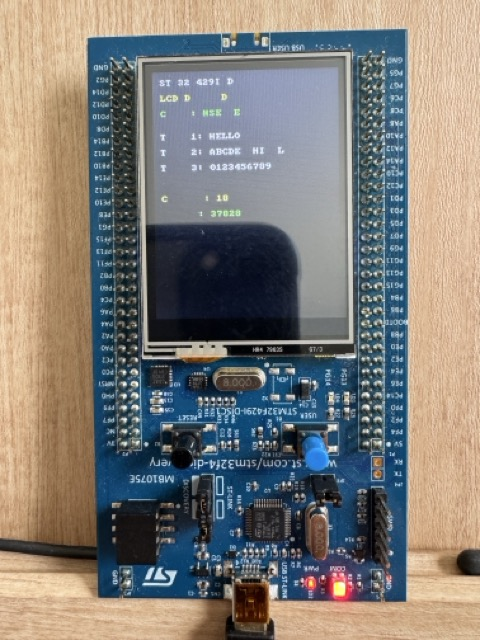

# Simple Print Demo on STM32F429I-Discovery LCD

## Table of Contents
- [Overview](#overview)
- [Requirements](#requirements)
- [Usage](#usage)
- [Discussion: What About `SysTick_Handler()`?](#discussion-what-about-systick_handler)
- [License](#license)

## Overview
This project demonstrates how to print text to the embedded LCD of the STM32F429I-Discovery board. It contains minimum number of code. The main take-away here is to learn how `SysTick_Handler()` works.

It uses PlatformIO within Visual Studio Code.

## Requirements

- **Board**: STM32F429I-Discovery
- **Development Environment**: Visual Studio Code with PlatformIO extension
- **PlatformIO Core**: 6.1.18  
- **PlatformIO Home**: 3.4.4

## Usage
Follow instructions in: [How does PlatformIO Project Work?](https://seanshnkim.github.io/blog/2025/PlatformIO-What-it-does/)

Build and flash the project using PlatformIO. After successful upload, messages should be printed to the LCD screen.

## Discussion: What About `SysTick_Handler()`?

- What happens if you remove `stm32f4xx_it.h` and `stm32f4xx_it.c` from this project?
- What does `SysTick_Handler()` specifically have to do with printing text on the LCD?
- What roles do these files play, and how are they related to exception and interrupt handling?

For answers, please refer to [Why does it display white screen after removing SysTick_Handler?](https://seanshnkim.github.io/blog/2025/SysTick_Handler/)

## License
This project is licensed under the MIT License.